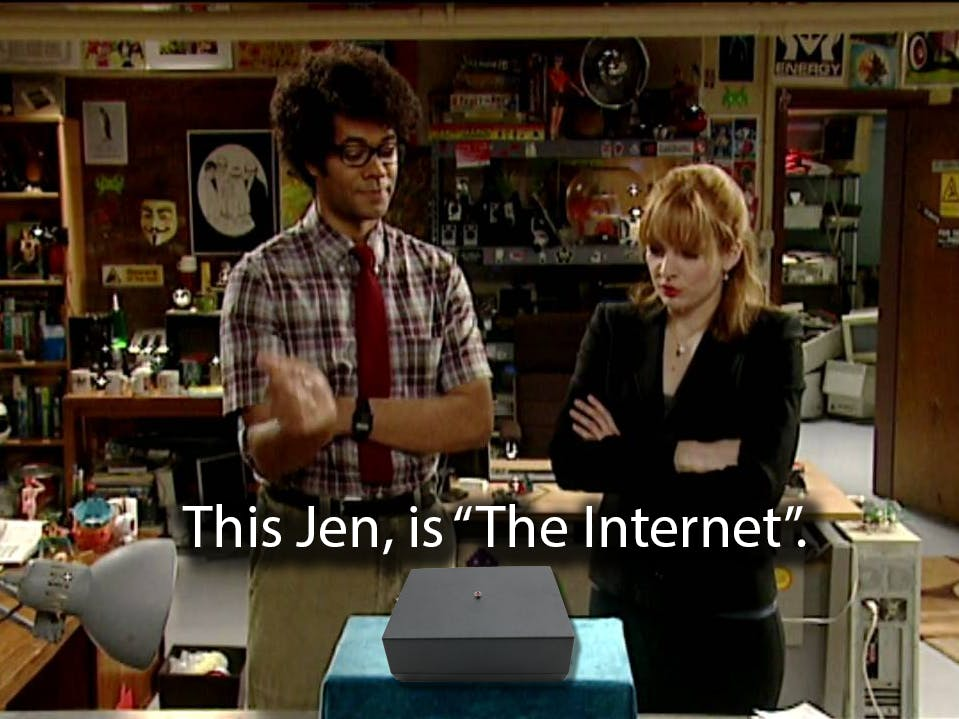

# Overview

This is a database of Internet places. Mostly domains. Sometimes other things. Think of it as Internet meta database. This repository contains link metadata: title, description, publish date, etc.

The entire Internt is in one file! Just unzip <b>internet.zip</b>!

<div align="center">
  
</div>

You can easily browse the file using any SQLite program, like DBeaver!

# Acceptable link types

 - domains
 - repository links. For example [https://github.com/rumca-js/Internet-Places-Database](https://github.com/rumca-js/Internet-Places-Database)
 - user spaces. Might be youtube channel link: [Linus Tech Tips YouTube Channel](https://www.youtube.com/channel/UCXuqSBlHAE6Xw-yeJA0Tunw). Might be X/Twitter user account

# Not acceptable link types

 - malware sites
 - porn, casino, gambling etc.
 - analytic domains that are used for user surveillance
 - IT infrastructure domains, CDN domains
 - link shorteners. somethingsomething.lnk.to is not something useful. Main domain lnk.to is acceptable though
  
Some zen rules:

 - Anything not obeying the law will be removed from lists
 - Internet operates in ... many countries, so there are many laws
 - If things are offensive, they do not have to be removed
 - I might suspect that a page is notorious, I may flag it with a tag, like "piracy", but it may not be true
 - If page content is obnoxious, it can, and possible should be demoted
 - I do not always follow these rules strictly

The goal is to check how "wide" the Internet is, not how "deep" individual places are!
 
# I do not have resources to verify all links

 - Links are captured from the Internet automatically
 - If any link is suspicious, and should be removed, please create an Issue in this repository
 - Use 'votes' to see credibility of domains
 - Be careful, Internet is a dangerous space. You should know what you are doing when using this list

# Example

 - [Simple Search](https://rumca-js.github.io/search) uses domains that have votes > 0

 - [Music search](https://rumca-js.github.io/music) music bookmarks. Not really related, but you can check it out

# Sources of data

Obtained by the [Django-link-archive](https://github.com/rumca-js/Django-link-archive) web crawler.

Sources:

 - [https://nownownow.com/](https://nownownow.com/)
 - [https://searchmysite.net/](https://searchmysite.net/)
 - [https://downloads.marginalia.nu/](https://downloads.marginalia.nu/)
 - [https://aboutideasnow.com/](https://aboutideasnow.com/)
 - [https://neocities.org/](https://neocities.org/)
 - hacker front page entries
 - some reddit channels [r/selfhosted](https://www.reddit.com/r/selfhosted/.rss)
 - GitHub [awesome lists](https://github.com/sindresorhus/awesome)
 - GitHub [awesome pastebins](https://github.com/lorien/awesome-pastebins)
 - GitHub [awesome DNS](https://github.com/curl/curl/wiki/DNS-over-HTTPS)
 - GitHub [Game hacking](https://github.com/dsasmblr/game-hacking)
 - [gov sites](https://manage.get.gov/api/v1/get-report/current-full)
 - [Hacker News RSS](https://news.ycombinator.com/item?id=12804406)

<div align="center">
  
</div>

# Benefit - Security

Google Search is known to be susceptible to malvertising. Predatory web pages can "disguise" them as other pages. The displayed link in Google Search does not have to be the linked you will be transported to.

 - This local search does not require Internet to operate. Once downloaded - you can just search these meta information
 - This local search might be faster than your ISP, depending on drive, machine, etc
 - It may be more secure. You can verify domain, it's status, how long it operates before accessing the Internet

# Other sources of web crawling data

There are many interesting places that provide information about web crawling

*Web crawling & Data Archives*
- [Common Crawl](https://commoncrawl.org/)
- [Internet Archive](https://www.archive.org/)
- [Anna's Archive](https://annas-archive.org/)
- [Awesome crawler data](https://github.com/BruceDone/awesome-crawler)
- [Kiwix](https://kiwix.org/)
- [Sci Hub](https://sci-hub.se)
- [Internet in a box](https://internet-in-a-box.org/)

*Ranking and metrics*
- [Open page rank](https://publicapi.dev/open-page-rank-api)
- [Page rank](https://en.wikipedia.org/wiki/PageRank)

*Academic and news content*
- [Arxiv](https://arxiv.org/)
- [Guardian newspaper](https://theguardian.newspapers.com/)

# Stats

Tables, and sizes (will definitely change over time)
```
Table: blockentrylist, Row count: 28
Table: browser, Row count: 8
Table: compactedtags, Row count: 3833
Table: configurationentry, Row count: 1
Table: credentials, Row count: 0
Table: dataexport, Row count: 0
Table: domains, Row count: 1541639
Table: entrycompactedtags, Row count: 17390
Table: entryrules, Row count: 15
Table: gateway, Row count: 82
Table: linkdatamodel, Row count: 1544699
Table: modelfiles, Row count: 0
Table: readlater, Row count: 0
Table: searchview, Row count: 11
Table: socialdata, Row count: 35416
Table: sourcecategories, Row count: 9
Table: sourcedatamodel, Row count: 11704
Table: sourcesubcategories, Row count: 14
Table: user, Row count: 5
Table: userbookmarks, Row count: 2352
Table: usercomments, Row count: 0
Table: usercompactedtags, Row count: 3833
Table: userconfig, Row count: 3
Table: userentrytransitionhistory, Row count: 10948
Table: userentryvisithistory, Row count: 5001
Table: usersearchhistory, Row count: 0
Table: usertags, Row count: 26352
Table: uservotes, Row count: 28005
```

# Contributing
 - [Contributing instructions](https://github.com/rumca-js/Internet-Places-Database/blob/main/CONTRIBUTING.md)

Notes:
 - most of user actions are performed by user name 'rumpel'. You may not like it, but I don't like 'admin'
 
# Files

Data are distributed in internet.zip file, split with 50MB parts.

To use it, you have to unpack it.

The result internet.db database file can be viewed using any sqlite browser / program.

Each link contains a set of attributes, like:
 - title
 - description
 - page rating
 - date of creation
 - date of last seen
 - etc.

You can run queries to find information about tags, etc.
```
SELECT *
FROM linkdatamodel
JOIN usertags
ON linkdatamodel.id = usertags.entry_id;
```

# Page rating

Content ranking is established by the [Django link archive](https://github.com/rumca-js/Django-link-archive) project.

To have a good page rating, it is desireable to follow good standards:
 - [Schema Validator](https://validator.schema.org/)
 - [W3C Validator](https://validator.w3.org/)
 - Provide HTML meta information. More info in [Open Graph Protocol](https://ogp.me/)
 - Provide valid title, which is concise, but not too short
 - Provide valid description, which is concise, but not too short
 - Provide valid publication date
 - Provide valid thumbnail, media image
 - Provide a valid HTML status code. No fancy redirects, JavaScript redirects
 - Provide RSS feed. Provide HTML meta information for it [https://www.petefreitag.com/blog/rss-autodiscovery/](https://www.petefreitag.com/blog/rss-autodiscovery/)
 - Provide search engine keywords tags

Your page, domain exist alongside thousands of other pages. Imagine your meta data have an impact on your recognition, and page ranking.

Remember: a good page is always ranked higher.

You may wonder, why am I writing about search engine "keywords" meta field, if Google does not need them. Well I don't like Google. If we want alternative solutions to exist, it should be possible to easily find your page from simpler search engines. Provide keywords field if you support open web.

# Tags

Some tags are quite obvious:

 - company - if entry exists just to provide information about company
 - university, museum, etc - if entry provides details about a university, museum, etc.
 - disinformation / misinformation - self explanatory
 - news - if it is "news" content farm. Might be also "game news", "tech news", etc.
 - web spam - anything annoying, not worth, etc.
 - warhammer - anything that relates to...
 - radio station
 - movie - page describing a movie
 - video game - page describing a video game, etc.
 - movie - page describing a movie
 - fan page - pages created by fans, of topics, of people
 - online tool - some things are web programs, that are not accessible if you are offline
 - ad business - if page owner work in this sector
 - nfsw - not safe for work
 - convention - gathering of hobbyist etc.

Some other notable examples

 - open source - if entry is "open source" related
 - personal - if it seems to be a personal website
 - personal sites source - pages where you can find more personal sites
 - self-host - software that can be self-hosted
 - amiga / commodore  - anything amiga / commodore related
 - demoscene / zx spectrum - related to this kind of music
 - emulator / emulation - anything related to emulators
 - wtf - for really interesting finds
 - funny - anything that makes me chuckle
 - interesting page design - self explanatory. Some pages are just fun
 - interesting domain name - if domain name is interesting
 - wargames / tabletop game - there are some old blogs about this hobby
 - internet archive - valuable resources that protect knowledge
 - reverse engineering
 - hacking / cubersecurity / ctf - quite explanatory
 - ranking page - page which shows items with scores, like metacritic, pepper
 - image assets / music assets / 

Other
 - artificial intelligence bot - AI bot, like chatGPT, etc.
 - gatekeeper - platforms that are too big to fail. Monopolies, big tech, etc.
 - link service - link service, link shorteners, ad counters
 - monetization - if page includes some kind of monetization, subscription, loot boxes
 - gambling - if the page is about gambling
 - redirect issue - the page is not what it is supposed to be, redirects to some adult page etc.
 - the left wing - things for democrats, left wing of political spectrum
 - the right wing - things for republicans, left wing of political spectrum
 - conspiracy theories / 911

# How to access the data?

Any SQLite database reader software, like DBeaver.

## CLI script

Do you want to search the database? I have got you covered! Use dataanalyzer.py

First install poetry. Then perform 'poetry update'. Then you can use the script.

Unpack internet.zip, then...

```
usage: dataanalyzer.py [-h] [--db DB] [--search SEARCH] [--order-by ORDER_BY] [--asc] [--desc]
                       [--table TABLE] [--title] [--description] [--tags] [--social]
                       [--date-published] [--source] [--summary] [--columns] [-i] [-v VERBOSITY]

Data analyzer program

options:
  -h, --help            show this help message and exit
  --db DB               DB to be scanned
  --search SEARCH       Search, with syntax same as the main program / site.
  --order-by ORDER_BY   order by column.
  --asc                 order ascending
  --desc                order descending
  --table TABLE         Table name
  --title               displays title
  --description         displays description
  --tags                displays tags
  --social              displays social data
  --date-published      displays date-published
  --source              displays source
  --summary             displays summary of tables
  --columns             displays summary of tables column nmaes
  -i, --ignore-case     Ignores case
  -v VERBOSITY, --verbosity VERBOSITY
                        Verbosity level
```

Search for warhammer in link, title, description. Shows title
```
dataanalyzer.py --db internet.db --search "*warhammer*" --title
```

Search for warhammer in link name. Shows title, tags
```
dataanalyzer.py --db internet.db --search "link=*warhammer*" --title --tags
```

Search for youtube channels
```
dataanalyzer.py --db internet.db --search "link=*youtube.com/channel*" --title --tags --social
```

## Access via web interface

```
unpack internet.zip
python3 -m http.server 8000          # start server
https://localhost:8000/search.html   # visit
```

<div align="center">
  
</div>

## Search box input

You can search by keywords, so searching by 'Yandex', 'Bing' should work.

The search by default is case insensitive.

If LIKE exists in query, then input is treated as part of "WHERE" query.

# You don't like it? Fork it!

I have my own opinions, with which you do not have to agree. Most of tags, votes are added manually. You can use this repository, as a starting point, to kick off your own project. Add your own tags. Create your own version of search engine. Good luck!

# Notes

 - Not all domains have to be stored here. I think it would be best to have valuable domains. Certainly we do not want content farms. We do not need sites that do not contribute anything useful to the society, to the reader
 - The distinction is not that clear-cut, but more lenient rules apply toward personal sites
 - I am not that interested in marking substack, or medium as "personal" sites, as I do not feel that it should be tagged as such
 
<div align="center">
  
</div>

# Roadmap

- [x] Initial relase. Provide commonly used domains. YouTube, google, etc
- [x] Define sources of data. Use indie web sources
- [x] Define clean tag names, so that the database can easily be searched
- [x] Advertise in indie web sources. Potentially: HN, reddit self-host, reddit web scraping forums. Amiga board. Nice, hackery places
- [x] Provide binary releases. SQLlite database, so that it would be easily imported by other tools
- [x] Establish plan for binary releases
- [ ] Create mobile app for searching. Upload to Google play & F-Droid
- [ ] Gather data using VPN, to receive english meta information
- [ ] Secure funds for a organisation. Kickstarter?
- [ ] Establish valid, simple domain for the project
- [ ] Provide google-like search on the domain
- [ ] Conquer the world
