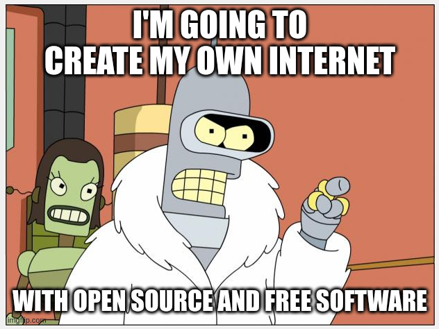

# Overview

This is a database of Internet places. Mostly domains. Sometimes other things. Think of it as Internet meta database. This repository contains link metadata: title, description, publish date, etc.

  

# Acceptable link types

 - domains
 - repository links. For example [https://github.com/rumca-js/Internet-Places-Database](https://github.com/rumca-js/Internet-Places-Database)
 - user spaces. Might be youtube channel link: [Linus Tech Tips YouTube Channel](https://www.youtube.com/channel/UCXuqSBlHAE6Xw-yeJA0Tunw). Might be X/Twitter user account

# Not acceptable link types

 - malware sites
 - porn, casino, gambling etc.
 - analytic domains that are used for user surveillance
 - IT infrastructure domains, CDN domains
 - link shorteners. somethingsomething.lnk.to is not something useful. Main domain lnk.to is acceptable though
  
Some zen rules:

 - Anything not obeying the law will be removed from lists
 - Internet operates in ... many countries, so there are many laws
 - If things are offensive, they do not have to be removed
 - If page content is obnoxious, it can, and possible should be demoted
 - I do not always follow these rules strictly

If any link is suspicious, and should be removed, plaese create an Issue in this repository. Links are captured from the Internet automatically. I do not have resources to verify them all. Use 'votes' to see credibility of domains.

# Sources of data

Obtained by the [Django-link-archive](https://github.com/rumca-js/Django-link-archive) web crawler.

Sources:

 - [https://nownownow.com/](https://nownownow.com/)
 - [https://searchmysite.net/](https://searchmysite.net/)
 - [https://downloads.marginalia.nu/](https://downloads.marginalia.nu/)
 - [https://aboutideasnow.com/](https://aboutideasnow.com/)
 - [https://neocities.org/](https://neocities.org/)
 - hacker front page entries
 - some reddit channels [r/selfhosted](https://www.reddit.com/r/selfhosted/.rss)
 - awesome lists, like [awesome](https://github.com/sindresorhus/awesome)

  

# Benefit - Security

Google Search is known to be susceptible to malvertising. Predatory web pages can "disguise" them as other pages. The displayed link in Google Search does not have to be the linked you will be transported to.

 - This local search does not require Internet to operate. Once downloaded - you can just search these meta information
 - This local search might be faster than your ISP, depending on drive, machine, etc
 - It may be more secure. You can verify domain, it's status, how long it operates before accessing the Internet

# Alternative solutions

- [Internet Archive](https://www.archive.org/)
- [Common Crawl](https://commoncrawl.org/)
- [Arxiv](https://arxiv.org/)
- [Anna's Archive](https://annas-archive.org/)
- [Guardian newspaper](https://theguardian.newspapers.com/)

# Files

The database is distributed as a set of JSON files. We do not want to store binary data, binary files. SQL files should be fine, but I am going with JSON files for now.

Each link contains a set of attributes, like:
 - title
 - description
 - page rating
 - date of creation
 - date of last seen
 - etc.

# Page rating

Content ranking is established by the [Django link archive](https://github.com/rumca-js/Django-link-archive) project.

To have a good page rating, it is desireable to follow good standards:
 - [Schema Validator](https://validator.schema.org/)
 - [W3C Validator](https://validator.w3.org/)
 - Provide HTML meta information. More info in [Open Graph Protocol](https://ogp.me/)
 - Provide valid title, which is concise, but not too short
 - Provide valid description, which is concise, but not too short
 - Provide valid publication date
 - Provide valid thumbnail, media image
 - Provide a valid HTML status code. No fancy redirects, JavaScript redirects
 - Provide RSS feed. Provide HTML meta information for it [https://www.petefreitag.com/blog/rss-autodiscovery/](https://www.petefreitag.com/blog/rss-autodiscovery/)
 - Provide search engine keywords tags

Your page, domain exist alongside thousands of other pages. Imagine your meta data have an impact on your recognition, and page ranking.

Remember: a good page is always ranked higher.

You may wonder, why am I writing about search engine "keywords" meta field, if Google does not need them. Well I don't like Google. If we want alternative solutions to exist, it should be possible to easily find your page from simpler search engines. Provide keywords field if you support open web.

# Tags

Each entry can be tagged. Most notable examples of tags

 - open source - if entry is "open source" related
 - personal - if it seems to be a personal website
 - personal sites source - pages where you can find more personal sites
 - self-host - software that can be self-hosted
 - amiga / commodore  - anything amiga / commodore related
 - demoscene / zx spectrum - related to this kind of music
 - emulator/emulation - anything related to emulators
 - wtf - for really interesting finds
 - funny - anything that makes me chuckle
 - interesting page design - self explanatory. Some pages are just fun
 - interesting domain name - if domain name is interesting
 - wargames - there are some old blogs about this hobby
 - internet archive - valuable resources that protect knowledge
 - reverse engineering
 - hacking / cubersecurity / ctf - quite explanatory
 - convention - you might be interested in one of those

Quite obvious tag names

 - company - if entry exists just to provide information about company
 - university, museum, etc - if entry provides details about a university, museum, etc.
 - disinformation / misinformation / conspiracy theories - self explanatory
 - news - if it is "news" content farm. Might be also "game news", "tech news", etc.
 - web spam - anything annoying, not worth, etc.
 - warhammer - anything that relates to...
 - link service - bitly or other services that provide shortened versions of links
 - radio station
 - movie - page describing a movie
 - video game - page describing a video game, etc.
 - movie - page describing a movie
 - fan page - pages created by fans, of topics, of people
 - online tool - some things are web programs, that are not accessible if you are offline
 - monetization - if page includes some kind of monetization, subscription, loot boxes
 - ad business - if page owner work in this sector

Other

 - artificial intelligence bot - bots that can respond to your queries
 - gatekeeper - platforms that are too big to fail. Monopolies, big tech, etc.

# Releases

Binary releases will be provided in form of SQLite table. The tables should be similar, if not exatcly same as in [Django link archive](https://github.com/rumca-js/Django-link-archive) project. Use SQL viewer to see what kind of data it contains. Table "entries" with fields such as "title", "description" etc.

This binary release can be used directly as-is in any project you like.

Binary releases will be generated on-demand, when necessary.

# Notes

 - Not all domains have to be stored here. I think it would be best to have valuable domains. Certainly we do not want content farms. We do not need sites that do not contribute anything useful to the society, to the reader
 - The distinction is not that clear-cut, but more lenient rules apply toward personal sites
 - I am not that interested in marking substack, or medium as "personal" sites, as I do not feel that it should be tagged as such
 
# Demo database

Might not be working. Used for development: [https://renegat0x0.ddns.net/apps/places/](https://renegat0x0.ddns.net/apps/places/).

  

# Roadmap

- [x] Initial relase. Provide commonly used domains. YouTube, google, etc
- [x] Define sources of data. Use indie web sources
- [x] Define clean tag names, so that the database can easily be searched
- [x] Advertise in indie web sources. Potentially: HN, reddit self-host, reddit web scraping forums. Amiga board. Nice, hackery places
- [x] Provide binary releases. SQLlite database, so that it would be easily imported by other tools
- [ ] Establish plan for binary releases
- [ ] Create a browser extension. The extension should provide domain info for each link. Provides rating according to page_rating, and since when page operates. The longer domain is active - the better
- [ ] Secure funds for a organisation. Kickstarter?
- [ ] Establish valid, simple domain for the project
- [ ] Provide google-like search on the domain
- [ ] Conquer the world
